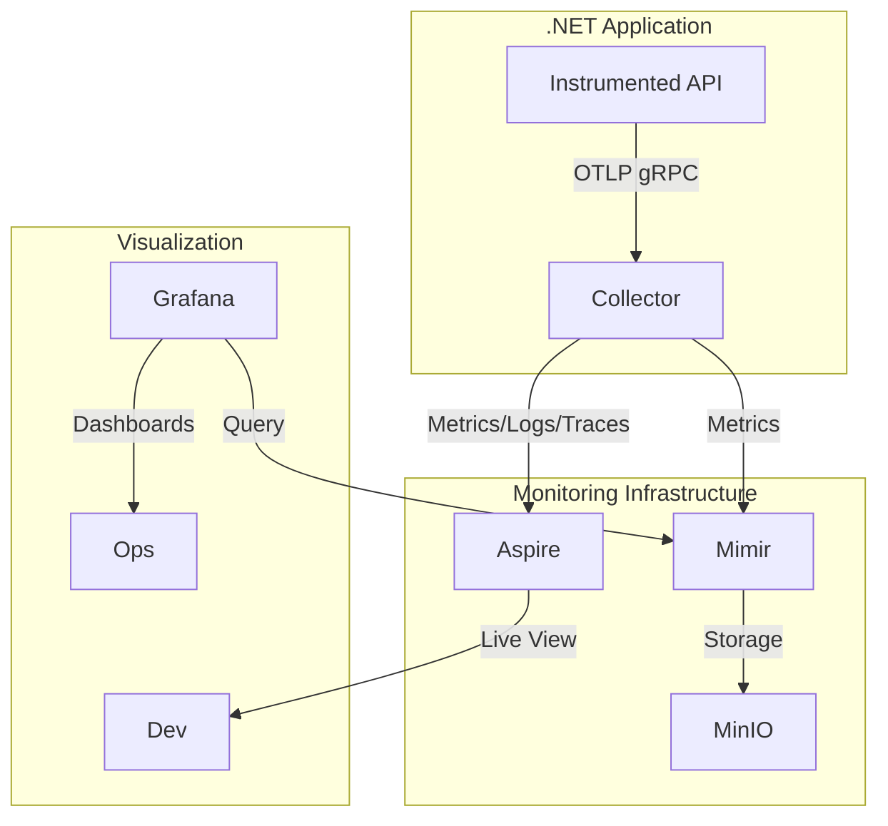

# Local Monitoring Stack with Aspire Dashboard

A complete local monitoring solution with real-time metrics (Aspire Dashboard), historical analysis (Grafana+Mimir), and distributed tracing. Built with OpenTelemetry collector and cloud-native storage.

## 🚀 Prerequisites
- Docker 23.0+
- Docker Compose 2.20+
- .NET 8.0+ (for instrumented apps)

## ⚙️ Initial Setup
```bash
git clone https://github.com/danielvieiravega/observability-stack.git
cd observability-stack
docker-compose up -d
```

## 🌐 Services Overview
| Service               | Endpoint                     | Credentials         | Purpose                      |
|-----------------------|------------------------------|---------------------|------------------------------|
| Aspire Dashboard      | http://localhost:18888       | Open access         | Real-time metrics & traces   |
| Grafana               | http://localhost:3000        | admin/admin         | Historical dashboards        |
| Mimir (Prometheus)    | http://localhost:9009        | -                   | Metrics storage              |
| MinIO                 | http://localhost:9001        | mimir/supersecret   | Persistent storage           |
| OTLP Collector        | grpc://localhost:4317        | -                   | Telemetry collection         |

## 🔧 Application Instrumentation
Add to `.NET Program.cs`:
```csharp
builder.Services
    .AddOpenTelemetry()
    .WithMetrics(metrics =>
    {
        metrics.AddAspNetCoreInstrumentation();
        metrics.AddHttpClientInstrumentation();
        metrics.AddProcessInstrumentation();
        metrics.AddRuntimeInstrumentation();
        metrics.AddOtlpExporter(opts =>
        {
            opts.Endpoint = new Uri("http://localhost:4317");
            opts.Protocol = OpenTelemetry.Exporter.OtlpExportProtocol.Grpc;
        });
    })
    .WithTracing(tracing =>
    {
        tracing.AddAspNetCoreInstrumentation();
        tracing.AddHttpClientInstrumentation();
        tracing.AddEntityFrameworkCoreInstrumentation();
        tracing.AddOtlpExporter(opts =>
        {
            opts.Endpoint = new Uri("http://localhost:4317");
            opts.Protocol = OpenTelemetry.Exporter.OtlpExportProtocol.Grpc;
        });
    })
    .WithLogging(logging =>
    {
        logging.AddOtlpExporter(opts =>
        {
            opts.Endpoint = new Uri("http://localhost:4317");
            opts.Protocol = OpenTelemetry.Exporter.OtlpExportProtocol.Grpc;
        });
    })
    .ConfigureResource(resource =>
    {
        resource
            .AddTelemetrySdk()
            .AddService("OpenTelemetryDemoApi", serviceVersion: "1.0.0")
            .AddOperatingSystemDetector()
            .AddEnvironmentVariableDetector();
    });
```

See a sample [instrumented API](https://github.com/danielvieiravega/OpenTelemetryDemo/blob/9e543fab46d7b9baa2c3f27682ef0c65b408085d/Program.cs#L16) for reference.


## 🛠️ Essential Commands
```bash
# Start stack
docker-compose up -d

# View logs
docker-compose logs -f otel-collector

# Full cleanup
docker-compose down -v
```

## 📐 Architecture


## ⚠️ Important Notes
- Default credentials are for local use only
- Add TLS for production environments
- Data retention: 7 days (adjust in mimir-config.yaml)
